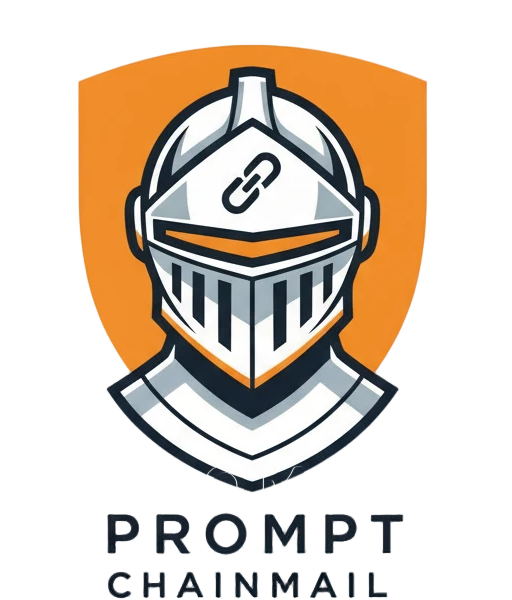

# Prompt Chainmail (beta)

<div align="center">
  
</div>

**Security middleware for AI prompt protection**

Composable defense framework protecting your AI prompts from prompt injection, role confusion, and encoded attacks with enterprise monitoring.

[](https://github.com/alexandrughinea/prompt-chainmail/actions/workflows/ci.yml)
[](https://badge.fury.io/js/prompt-chainmail)
[](http://www.typescriptlang.org/)
[](https://github.com/alexandrughinea/prompt-chainmail/actions/workflows/security.yml)
[](https://github.com/alexandrughinea/prompt-chainmail/blob/main/LICENSE)
[](mailto:alexandrughinea.dev+prompt-chainmail@gmail.com)
[](https://github.com/alexandrughinea/prompt-chainmail#enterprise-edition)

## Features

- **Security** - Composable rivet system (dedicated security plugins) for enterprise-scale deployments
- **Zero Dependencies** - Minimal attack surface with no external dependencies
- **TypeScript** - Full type safety, IntelliSense support, and strict mode compliance
- **Compliance Ready** - Built-in audit logging and security event tracking for SOC2/ISO27001
- **Monitoring Integration** - Native support for Datadog, New Relic, Sentry, and custom telemetry

## Quick Start

```bash
npm install prompt-chainmail
```

**Note:** `Chainmails` provides a security preset for quick setup. For complete control over your protection chain, use `new PromptChainmail()` and compose your own rivets.

### Basic Usage (Security Preset)

Other security presets are also available for a tiered approach to security:

- `Chainmails.basic(maxLength, confidenceFilter)` - Basic security preset
- `Chainmails.advanced(maxLength, confidenceFilter)` - Advanced security preset
- `Chainmails.development(maxLength, confidenceFilter)` - Development security preset with logging
- `Chainmails.strict(maxLength, confidenceFilter)` - Stricter security preset

```typescript
import { Chainmails } from 'prompt-chainmail';

const chainmail = Chainmails.strict();
const result = await chainmail.protect(userInput);

if (!result.success) {
  console.log('Security violation:', result.context.flags);
} else {
  console.log('Safe input:', result.context.sanitized);
}
```

### Custom Protection
```typescript
import { PromptChainmail, Rivets } from 'prompt-chainmail';

const chainmail = new PromptChainmail()
  .forge(Rivets.sanitize())
  .forge(Rivets.patternDetection())
  .forge(Rivets.confidenceFilter(0.8));

const result = await chainmail.protect(userInput);
```

### Production Monitoring
```typescript
import { Chainmails, Rivets, createSentryProvider } from 'prompt-chainmail';
import * as Sentry from '@sentry/node';

Sentry.init({ dsn: 'your-dsn' });

const chainmail = Chainmails.strict()
  .forge(Rivets.telemetry({
    provider: createSentryProvider(Sentry)
  }));
```

### Conditional Assembly
```typescript
import { PromptChainmail, Rivets } from 'prompt-chainmail';

const chainmail = new PromptChainmail();

if (needsBasicProtection) {
  chainmail.forge(Rivets.sanitize());
}

if (detectInjections) {
  chainmail.forge(Rivets.patternDetection());
}

// Custom business logic
chainmail.forge(Rivets.condition(
  (ctx) => ctx.sanitized.includes('sensitive_keyword'),
  'sensitive_content',
  0.3
));

const result = await chainmail.protect(userInput);
```

## LLM Integration

```typescript
import OpenAI from 'openai';
import { Chainmails } from 'prompt-chainmail';

const openai = new OpenAI({ apiKey: process.env.OPENAI_API_KEY });
const chainmail = Chainmails.strict();

async function secureChat(userMessage: string) {
  const result = await chainmail.protect(userMessage);
  
  if (!result.success) {
    throw new Error(`Security violation: ${result.context.flags.join(', ')}`);
  }

  return await openai.chat.completions.create({
    model: "gpt-4",
    messages: [
      { role: "system", content: "You are a helpful assistant." },
      { role: "user", content: result.context.sanitized }
    ]
  });
}
```

## Rivets

**Rivets** are composable security middleware functions that process input sequentially. Each rivet can inspect, modify, or block content before passing it to the next rivet in the chain. They execute in the order they are forged, allowing you to build layered security defenses.

### Rivet Signature
```typescript
export type ChainmailRivet = (
  context: ChainmailContext,
  next: () => Promise<ChainmailResult>
) => Promise<ChainmailResult>;
```

Rivets are **sequential** - each rivet processes the output of the previous rivet:
```typescript
const chainmail = new PromptChainmail()
  .forge(Rivets.sanitize())                 // 1st: Clean HTML/whitespace
  .forge(Rivets.patternDetection())         // 2nd: Detect injection patterns
  .forge(Rivets.confidenceFilter(0.8));     // 3rd: Block low confidence

// Input flows: sanitize → patternDetection → confidenceFilter → result
```

### Built-in security rivets

- `Rivets.sanitize()` - HTML removal, whitespace normalization
- `Rivets.patternDetection()` - Common injection patterns
- `Rivets.roleConfusion()` - Role manipulation detection
- `Rivets.encodingDetection()` - Base64/hex/binary/octal/ROT13/URL encoding detection
- `Rivets.structureAnalysis()` - Input structure anomaly detection
- `Rivets.codeInjection()` - Code execution attempts
- `Rivets.sqlInjection()` - SQL injection patterns
- `Rivets.delimiterConfusion()` - Context-breaking attempts
- `Rivets.instructionHijacking()` - Instruction override detection
- `Rivets.templateInjection()` - Template syntax injection detection
- `Rivets.confidenceFilter()` - Block low-confidence input
- `Rivets.rateLimit()` - Request rate limiting
- `Rivets.untrustedWrapper()` - Wrap content in security boundary tags
- `Rivets.httpFetch()` - External HTTP API calls with automatic (configurable) signal abort
- `Rivets.condition()` - Custom logic with predicates
- `Rivets.logger()` - Request logging and debugging
- `Rivets.telemetry()` - Monitoring integration

## Security Context

```typescript
const result = await chainmail.protect(userInput);

console.log({
  flags: result.context.flags,           // Security flags detected
  confidence: result.context.confidence, // Confidence score (0-1)
  blocked: result.context.blocked,       // Whether input was blocked
  sanitized: result.context.sanitized    // Cleaned input
});
```

## Telemetry

### Provider Integration
```typescript
// Sentry
import * as Sentry from '@sentry/node';
import { createSentryProvider } from 'prompt-chainmail';

Sentry.init({ dsn: 'your-dsn' });
chainmail.forge(Rivets.telemetry({
  provider: createSentryProvider(Sentry)
}));

// Datadog
import tracer from 'dd-trace';
import { createDatadogProvider } from 'prompt-chainmail';

tracer.init({
  service: 'prompt-chainmail',
  env: 'production'
});

chainmail.forge(Rivets.telemetry({
  provider: createDatadogProvider(tracer, console)
}));

// New Relic
import newrelic from 'newrelic';
import { createNewRelicProvider } from 'prompt-chainmail';

chainmail.forge(Rivets.telemetry({
  provider: createNewRelicProvider(newrelic)
}));

// Custom Provider
import { TelemetryProvider } from 'prompt-chainmail';

const customProvider: TelemetryProvider = {
  recordEvent: (event, context) => {
    // Send to your custom monitoring system
    fetch('/api/security-events', {
      method: 'POST',
      body: JSON.stringify({ event, context, timestamp: Date.now() })
    });
  },
  recordMetric: (name, value, tags) => {
    // Send metrics to your system
    console.log(`Metric: ${name} = ${value}`, tags);
  }
};

chainmail.forge(Rivets.telemetry({
  provider: customProvider
}));
```

## Examples

For comprehensive usage scenarios and custom rivet implementations, see [`examples.ts`](examples.ts) which includes:

- **Custom Rivet Development** - Building domain-specific security rivets
- **Advanced Chainmail Composition** - Complex protection workflows
- **Enterprise Integration Patterns** - Production deployment examples
- **Performance Optimization** - Efficient rivet ordering and configuration
- **Error Handling Strategies** - Robust failure management
- **Testing Approaches** - Unit and integration testing patterns

## License

Business Source License 1.1 - Free for non-production use, converts to Apache 2.0 on January 1, 2029.

For commercial licensing: [Contact](mailto:alexandrughinea.dev+prompt-chainmail@gmail.com)
